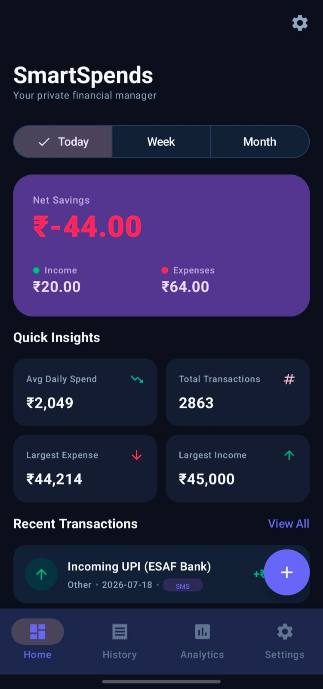
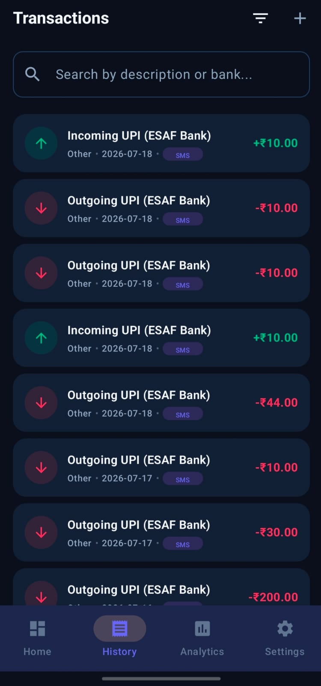
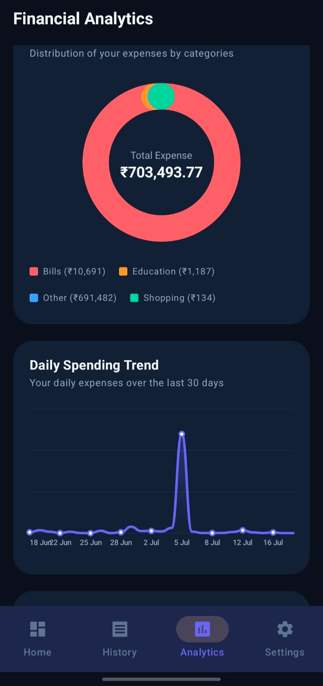
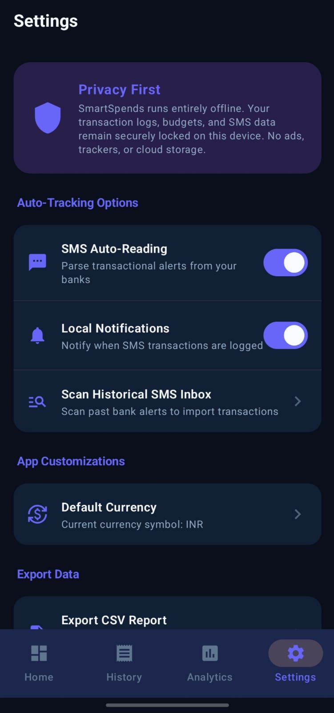

# SmartSpends

## App Screenshots

| Screenshot 1 | Screenshot 2 | Screenshot 3 | Screenshot 4 |
| :---: | :---: | :---: | :---: |
|  |  |  |  |

SmartSpends is a modern, offline-first, and privacy-respecting Android application designed to track user finances. It automatically parses transactional bank SMS messages to record debits and credits, while also allowing users to manually enter transactions. All data is stored locally in a Room database to prioritize user privacy.

## Key Features

- **Automatic SMS Parser**: Intercepts bank transaction alerts on-the-fly, extracts amount, credit/debit flag, masks account details, identifies transaction mode, and auto-assigns categories by scanning merchant keywords (e.g., Zomato, Uber, Fuel). 
- **Privacy First & Offline**: Runs entirely locally. No internet connectivity, no advertisements, no tracking, and no external cloud synchronization.
- **Dynamic Dashboard**: View today's, weekly, and monthly net savings, incomes, and expenses. Includes a quick statistics grid showing total transactions, largest transactions, and daily spending averages.
- **Custom Canvas Charts**: Lightweight, high-performance Canvas-drawn charts for category breakdowns (donut chart), monthly income vs expense summaries (double bar chart), and daily spending trends (bezier line chart).
- **Interactive Audits**: Full transaction history logs with search functionality, multi-criteria filtering (date, type, category, bank), sorting, and detailed bottom sheet view panels.
- **Recurring Transactions Detector**: Advanced timing interval analysis identifying recurring records like Salaries, EMIs, and Subscriptions.
- **Secure File Exports**: Generate CSV spreadsheets or draw statement reports to PDF pages using completely offline, native Android graphic modules.
- **Database Backup & Restore**: Backup your local database file to standard storage and restore it at any time.

---

## Technical Stack & Architecture

- **Language**: Kotlin
- **UI Framework**: Jetpack Compose (Material 3 - Dark & Light mode support)
- **Architecture**: Clean Architecture + MVVM + SOLID principles
- **Dependency Injection**: Hilt
- **Local Storage**: Room (SQLite wrapper) + Flow
- **Background Tasks**: WorkManager
- **Navigation**: Jetpack Compose Navigation

---

## Folder Structure

```
app/src/main/java/com/smartspends/app/
│
├── data/
│   ├── database/          # Room entities, DAOs, and database configurations
│   ├── parser/            # Core bank SMS Parsing engine
│   ├── receiver/          # SMS BroadcastReceiver interceptor
│   └── repository/        # Data Repository implementation mappings
│
├── domain/
│   ├── repository/        # Domain repository interfaces
│   └── usecase/           # Domain usecases (filtering, statistics, recurring detection)
│
├── ui/
│   ├── theme/             # Color styles, typography, and light/dark theme builders
│   ├── components/        # Canvas-drawn chart widgets
│   ├── navigation/        # Compose Navigation graph
│   └── screens/           # Presenter view controllers (Dashboard, Analytics, Settings, History)
│
└── di/                    # Dagger Hilt DI modules
```

---

## Getting Started

### Prerequisites
- Android Studio (Koala/Ladybug or newer) or VS Code.
- Java JDK 17 or higher.
- Gradle Wrapper (included in project configurations).

### Setup & Run
1. Clone this repository locally.
2. Open the project folder in **Android Studio** or your preferred editor.
3. If using an editor terminal, make sure your emulator/device is connected and run:
   ```powershell
   # Compile and install directly to the device
   .\gradlew installDebug
   ```
4. To run the automated unit test suite:
   ```powershell
   .\gradlew test
   ```
